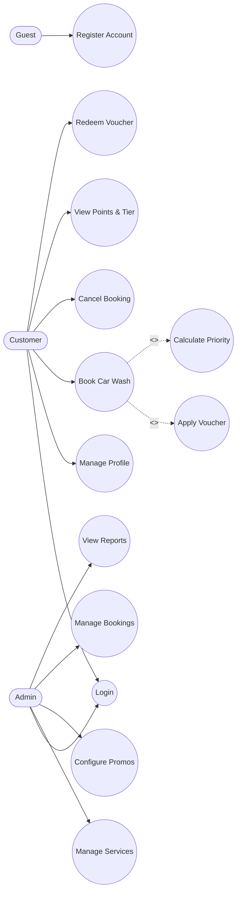
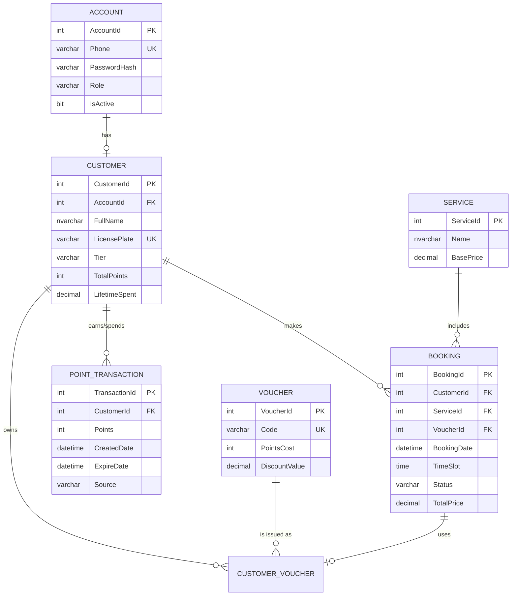
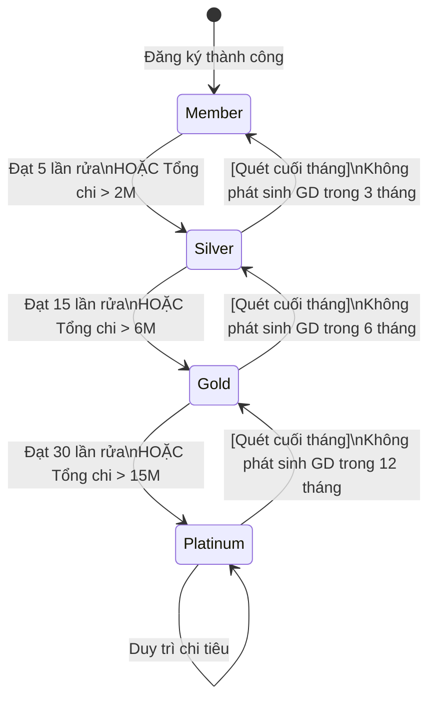
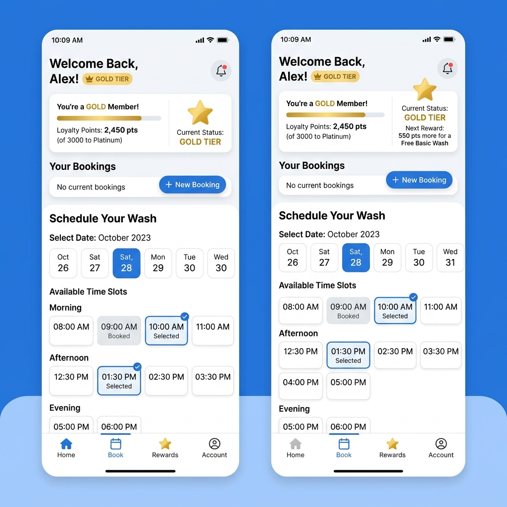
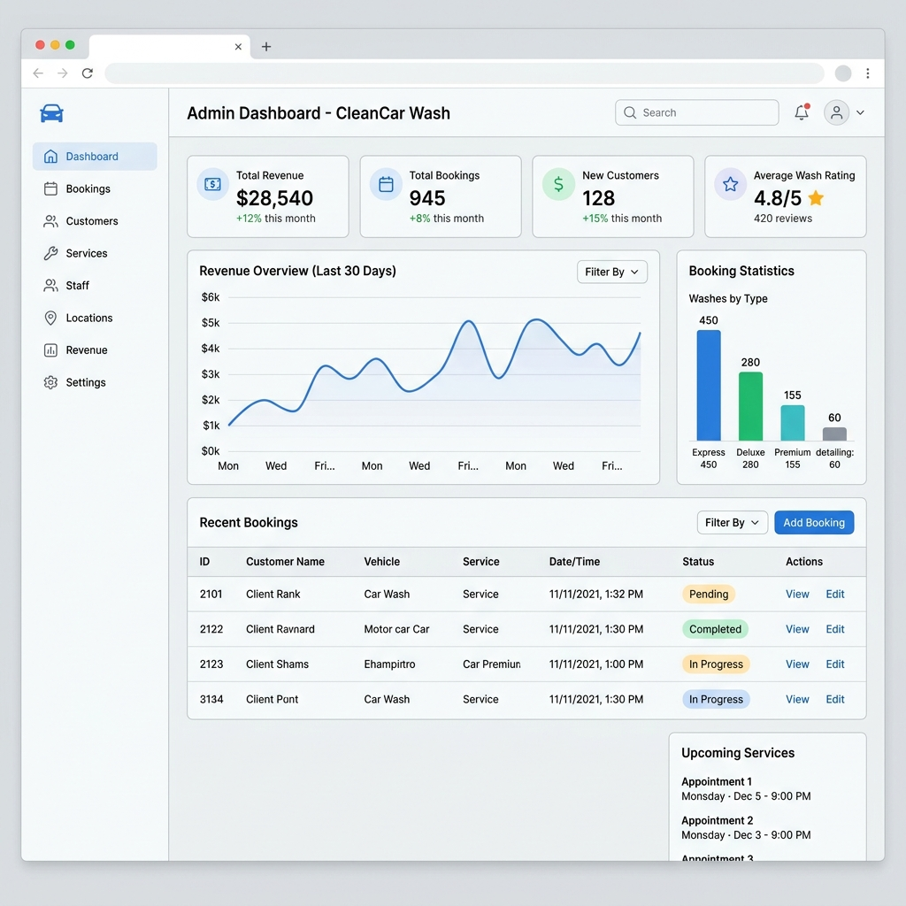

# TÀI LIỆU ĐẶC TẢ YÊU CẦU PHẦN MỀM (SRS)
**Dự án:** AutoWash Pro - Smart Automated Car Wash Management System
**Phiên bản:** 1.0 | **Ngày cập nhật:** 20/05/2026

---

## 1. MÔ HÌNH HÓA HỆ THỐNG (UML DIAGRAMS)

### 1.1. Sơ đồ Use Case (Use Case Diagram)
Sơ đồ tổng quan thể hiện sự tương tác giữa các tác nhân (Actors) và hệ thống.

### 1.2. Sơ đồ Thực thể Liên kết (Entity Relationship Diagram - ERD)
Cấu trúc cơ sở dữ liệu quan hệ cho hệ thống, đảm bảo tính toàn vẹn dữ liệu cho chức năng Booking và Loyalty.

### 1.3. Sơ đồ Máy trạng thái (State Machine Diagram - Loyalty Tiers)
Đặc tả logic vòng đời của hệ thống điểm thưởng và các điều kiện kích hoạt chuyển hạng.

---

## 2. ĐẶC TẢ USE CASE CHI TIẾT (DETAILED USE CASE)

Dưới đây là đặc tả cho 2 luồng nghiệp vụ cốt lõi và phức tạp nhất của hệ thống.

### UC-01: Đặt lịch rửa xe (Book Car Wash)
| Thành phần | Đặc tả |
| :--- | :--- |
| **Actor** | Customer |
| **Mô tả** | Khách hàng chọn dịch vụ, khung giờ và ngày để đặt lịch rửa xe. Hệ thống tính toán thời gian cho phép đặt dựa trên Tier. |
| **Pre-condition** | Khách hàng đã Login, có thông tin Biển số xe. |
| **Main Flow** | 1. Khách hàng truy cập trang "Đặt lịch". 2. Hệ thống load danh sách Dịch vụ (Services). 3. Khách hàng chọn Dịch vụ. 4. Hệ thống tính toán `Booking Window` theo Tier (VD: Silver = 10 ngày) và load các Slot trống. 5. Khách chọn ngày, giờ và add Voucher (nếu có). 6. Hệ thống tính Priority Score và lưu DB với trạng thái `Pending`. 7. Trả về thông báo thành công. |
| **Alternative Flow** | (4a) Nếu ngày khách muốn đặt nằm ngoài vùng `Booking Window` -> Ẩn nút chọn, hiển thị thông báo "Nâng hạng để đặt lịch xa hơn". (6a) Nếu tại thời điểm bấm Đặt, slot giờ đó vừa bị khách khác đặt trước -> Trả về lỗi "Khung giờ đã đầy", yêu cầu chọn lại. |
| **Post-condition** | Bản ghi Booking được tạo. Lịch sử đặt lịch của khách hàng được cập nhật. |

### UC-02: Đổi điểm lấy Voucher (Redeem Points)
| Thành phần | Đặc tả |
| :--- | :--- |
| **Actor** | Customer |
| **Mô tả** | Khách hàng sử dụng điểm Loyalty (FIFO) để đổi lấy Voucher giảm giá. |
| **Pre-condition** | Khách hàng đã Login. |
| **Main Flow** | 1. Khách hàng vào trang "Loyalty & Rewards". 2. Hệ thống hiển thị số dư điểm hiện tại và danh sách các Voucher có thể đổi. 3. Khách hàng bấm "Đổi" (Redeem) tại 1 Voucher. 4. Hệ thống kiểm tra số dư điểm >= `PointsCost`. 5. Áp dụng thuật toán FIFO: Trừ các Point có `ExpireDate` gần nhất trước. 6. Tạo bản ghi `CustomerVoucher` trạng thái `Unused`. 7. Thông báo đổi thưởng thành công. |
| **Alternative Flow** | (4a) Nếu điểm không đủ -> Hiển thị cảnh báo "Bạn cần thêm X điểm để đổi quà này". |
| **Post-condition** | Điểm bị trừ. Khách hàng có thể sử dụng Voucher này cho lần Booking tiếp theo. |

---

## 3. THIẾT KẾ GIAO DIỆN (UI WIREFRAMES / MOCKUPS)

Thiết kế giao diện được tối ưu hóa cho trải nghiệm người dùng, sử dụng phong cách hiện đại, trực quan (Glassmorphism, Clean layout).

### 3.1. Giao diện Customer (Mobile Web App)
> Tập trung vào việc hiển thị Tier hiện tại (Gold), Số dư điểm, và tính năng Đặt lịch (chọn Slot thời gian). Thiết kế chuẩn Mobile-first để khách hàng dễ dàng thao tác trên điện thoại.

### 3.2. Giao diện Admin Dashboard (Desktop Web)
> Tập trung vào biểu đồ doanh thu, thống kê lượt Booking trong ngày, và thanh Sidebar điều hướng nhanh tới các nghiệp vụ quản lý (Dịch vụ, Voucher, Báo cáo).

---

## 4. TỪ ĐIỂN DỮ LIỆU (DATA DICTIONARY)

Thiết kế chi tiết cấu trúc Database (hệ quản trị: SQL Server) để team Backend có thể viết DDL Script ngay lập tức.

### Bảng: `ACCOUNT`
| Cột | Kiểu dữ liệu | Độ dài | Constraint | Mô tả |
| :--- | :--- | :--- | :--- | :--- |
| `AccountId` | INT | | PK, Identity(1,1) | Khóa chính tự tăng |
| `Phone` | VARCHAR | 15 | UK, NOT NULL | Số điện thoại dùng để đăng nhập |
| `PasswordHash`| VARCHAR | 255 | NOT NULL | Mật khẩu đã mã hóa (BCrypt) |
| `Role` | VARCHAR | 20 | NOT NULL | `ADMIN` hoặc `CUSTOMER` |
| `IsActive` | BIT | 1 | Default(1) | Trạng thái tài khoản (1: Hoạt động) |

### Bảng: `CUSTOMER`
| Cột | Kiểu dữ liệu | Độ dài | Constraint | Mô tả |
| :--- | :--- | :--- | :--- | :--- |
| `CustomerId` | INT | | PK, Identity(1,1) | Khóa chính tự tăng |
| `AccountId` | INT | | FK | Tham chiếu đến ACCOUNT |
| `FullName` | NVARCHAR | 100 | NOT NULL | Họ và tên khách hàng |
| `LicensePlate`| VARCHAR | 20 | UK, NOT NULL | Biển số xe định danh |
| `Tier` | VARCHAR | 20 | Default('Member') | Hạng (`Member`, `Silver`, `Gold`, `Platinum`) |
| `TotalPoints` | INT | | Default(0) | Tổng điểm tích lũy hiện tại |
| `LifetimeSpent`| DECIMAL | 18,2 | Default(0) | Tổng tiền đã chi (dùng xét hạng) |

### Bảng: `BOOKING`
| Cột | Kiểu dữ liệu | Độ dài | Constraint | Mô tả |
| :--- | :--- | :--- | :--- | :--- |
| `BookingId` | INT | | PK, Identity(1,1) | Khóa chính |
| `CustomerId` | INT | | FK | Khách hàng đặt |
| `ServiceId` | INT | | FK | Dịch vụ được chọn |
| `BookingDate` | DATE | | NOT NULL | Ngày rửa xe |
| `TimeSlot` | TIME | | NOT NULL | Khung giờ cụ thể (VD: 08:00) |
| `Status` | VARCHAR | 20 | Default('Pending') | `Pending`, `Confirmed`, `Completed`, `Cancelled` |
| `TotalPrice` | DECIMAL | 18,2 | NOT NULL | Tổng tiền cần thanh toán (sau khi trừ Voucher) |

### Bảng: `POINT_TRANSACTION`
| Cột | Kiểu dữ liệu | Độ dài | Constraint | Mô tả |
| :--- | :--- | :--- | :--- | :--- |
| `TransactionId`| INT | | PK, Identity(1,1) | Khóa chính |
| `CustomerId` | INT | | FK | Chủ sở hữu điểm |
| `Points` | INT | | NOT NULL | Số điểm (+ là cộng, - là trừ) |
| `CreatedDate` | DATETIME | | Default(GETDATE()) | Ngày phát sinh giao dịch |
| `ExpireDate` | DATETIME | | | Hạn sử dụng của số điểm cộng này (sau 12 tháng) |
| `Source` | VARCHAR | 50 | | Lý do: `Booking_#123`, `Redeem_Voucher` |

> [!IMPORTANT]
> **Lưu ý triển khai DB:**
> * Cần đánh Index (Non-clustered Index) cho các cột thường xuyên query như `Phone`, `LicensePlate` và `BookingDate`.
> * Bảng `POINT_TRANSACTION` dùng để tracking chi tiết điểm vào/ra, giúp dễ dàng tính toán thuật toán rụng điểm (Expire) theo mô hình FIFO mà không làm sai lệch số dư hiện tại của khách.

